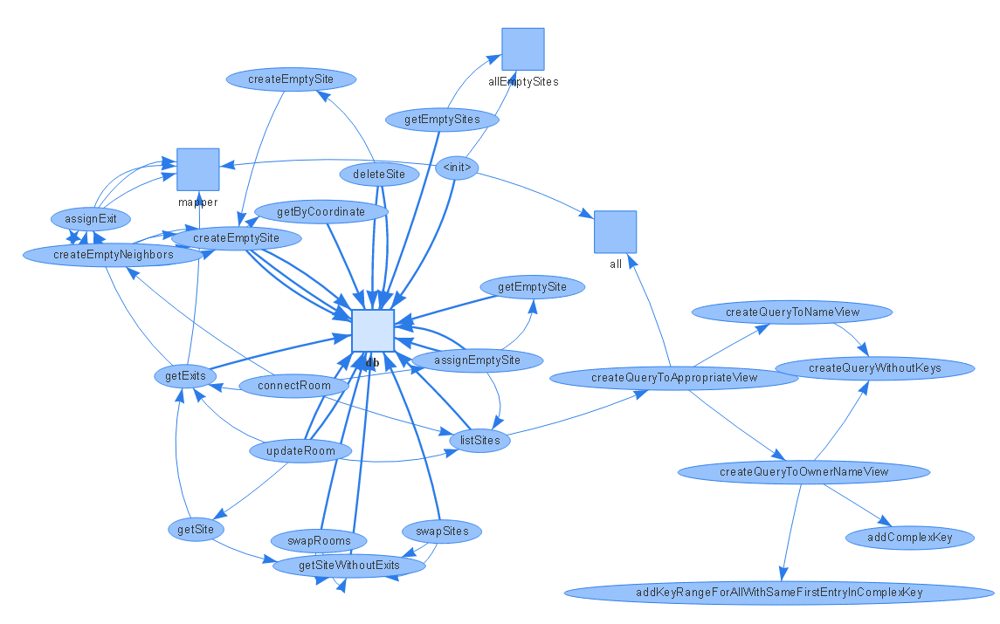

# Java Cohesion Visualiser
A tool to visualise the methods and fields as a network graph for a Java class to give an impression of it's cohesion.  An example of a class with high cohesion would be one where each method uses many/most of the other methods and fields in the class.  A class with low cohesion would be one where you see islands of methods that do not interact with other methods in the class, these are good candidates for splitting into their own class to adhear to the Single Responsibility Principle.

The tool works by using [asm]() to analyze a .class file and [visjs](http://visjs.org/) to visualise it.

## Running the tool
1. Download the latest release of the JavaCohesionVisualiser.jar
2. Download [asm-5.0.3.jar](http://search.maven.org/remotecontent?filepath=org/ow2/asm/asm/5.0.3/asm-5.0.3.jar) and [json-20160810.jar](http://search.maven.org/remotecontent?filepath=org/json/json/20160810/json-20160810.jar) from Maven Central to the same directory
3. Run `java -jar JavaCohesionVisualiser.jar <class>` where &lt;class> is the path to a Java .class file on your file system. Optionally you can specify an output file location as a second argument

This will create an HTML page in the directory you run the command from and open a browser to show the cohesion visualisation. 

## Example diagram
Generated for the class [SiteDocuments.java](https://github.com/gameontext/gameon-map/blob/master/map-app/src/main/java/org/gameontext/map/db/SiteDocuments.java). Note how the "query" methods on the right hand side are their own little island, this is a good example of a potential new class to handle the querying.

